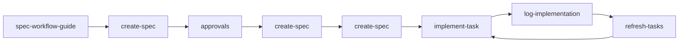

# Spec Workflow MCP 提示系统指南

## 概述

本文档详细介绍了 Spec Workflow MCP 的提示系统，包括所有提示模块的功能、设计理念、使用方法和最佳实践。提示系统为AI交互提供了结构化的指导，确保开发流程的一致性和效率。

## 提示系统架构

### 文件结构

```
src/prompts/
├── index.ts                          # 提示注册和管理入口
├── types.ts                          # 提示类型定义
├── create-spec.ts                    # 规范文档创建提示
├── create-steering-doc.ts            # 指导文档创建提示
├── implement-task.ts                 # 任务实施提示
├── spec-status.ts                    # 规范状态查询提示
├── inject-spec-workflow-guide.ts     # 工作流指导注入提示
├── inject-steering-guide.ts          # 指导文档注入提示
└── refresh-tasks.ts                  # 任务刷新提示
```

### 提示注册机制

提示采用统一的注册模式，通过 `index.ts` 管理：

```typescript
const promptDefinitions: PromptDefinition[] = [
  createSpecPrompt,
  createSteeringDocPrompt,
  implementTaskPrompt,
  specStatusPrompt,
  injectSpecWorkflowGuidePrompt,
  injectSteeringGuidePrompt,
  refreshTasksPrompt
];
```

### 核心设计原则

1. **上下文感知**：根据项目状态动态生成内容
2. **参数化驱动**：通过参数控制提示内容和行为
3. **结构化输出**：提供清晰的格式和模板
4. **错误处理**：优雅处理异常情况
5. **版本兼容**：支持不同格式的向后兼容

## 提示详细说明

### 1. create-spec - 创建规范文档

#### 功能描述
引导用户创建符合 spec-workflow 方法的规范文档，支持三种文档类型：requirements（需求）、design（设计）、tasks（任务）。

#### 提示定义
```typescript
export const createSpecPrompt: PromptDefinition = {
  name: 'create-spec',
  description: 'Create a new specification document following the spec-workflow method',
  arguments: [
    {
      name: 'specName',
      required: true,
      description: 'The feature name in kebab-case format (e.g., "user-authentication")'
    },
    {
      name: 'documentType',
      required: true,
      description: 'Type of document to create: requirements, design, or tasks'
    },
    {
      name: 'description',
      required: false,
      description: 'Optional description of the feature being specified'
    }
  ]
};
```

#### 支持的文档类型

##### Requirements（需求文档）
- **文件路径**：`.spec-workflow/specs/${specName}/requirements.md`
- **模板来源**：`.spec-workflow/templates/requirements-template.md`
- **主要内容**：用户故事、验收标准、业务需求
- **后续流程**：审批 → 设计阶段

##### Design（设计文档）
- **文件路径**：`.spec-workflow/specs/${specName}/design.md`
- **模板来源**：`.spec-workflow/templates/design-template.md`
- **主要内容**：架构设计、技术方案、接口定义
- **后续流程**：审批 → 任务阶段

##### Tasks（任务文档）
- **文件路径**：`.spec-workflow/specs/${specName}/tasks.md`
- **模板来源**：`.spec-workflow/templates/tasks-template.md`
- **主要内容**：具体实现任务、分配、时间估算
- **特殊字段**：包含 `_Prompt` 字段用于AI实施指导
- **后续流程**：开始实施

#### 特殊处理（Tasks文档）
```markdown
**Special Instructions for Tasks Document:**
- For each task, generate a _Prompt field in the format:
  "Role: [角色] | Task: [任务] | Restrictions: [约束] | Success: [成功标准]"
- Include implementation guidance for AI agents
- Provide leverage opportunities for existing code
- Reference specific requirements and design decisions
```

#### 使用示例
```bash
# 创建用户认证需求文档
提示名称: create-spec
参数:
  - specName: "user-authentication"
  - documentType: "requirements"
  - description: "用户身份验证和授权系统"

# 创建API设计文档
提示名称: create-spec
参数:
  - specName: "user-authentication"
  - documentType: "design"
  - description: "RESTful API设计"

# 创建实施任务
提示名称: create-spec
参数:
  - specName: "user-authentication"
  - documentType: "tasks"
  - description: "具体的实现任务分解"
```

#### 生成的内容示例
```markdown
# User Authentication Specification

## Context:
- Project: /path/to/project
- Feature: user-authentication
- Description: 用户身份验证和授权系统
- Dashboard: http://localhost:3000

## Instructions:

1. **Read the template**:
   - Template file: `.spec-workflow/templates/requirements-template.md`
   - Read this file first to understand the structure and sections required

2. **Create the document**:
   - File path: `.spec-workflow/specs/user-authentication/requirements.md`
   - Copy the template content as the starting point
   - Fill in each section with specific requirements for user authentication

3. **Review content**:
   - Ensure all template sections are completed
   - Include user stories, acceptance criteria, and business rules
   - Define security and compliance requirements

4. **After creating**:
   - Use approvals tool with action:'request' to get approval for this document
   - Title: "用户认证需求文档"
   - File path: `.spec-workflow/specs/user-authentication/requirements.md`
   - Type: 'document'
   - Category name: 'user-authentication'

Follow this workflow sequence to proceed to the next phase.
```

---

### 2. create-steering-doc - 创建指导文档

#### 功能描述
创建项目级别的指导文档（product.md、tech.md、structure.md），为整个项目提供高层次的指导和规范。

#### 提示定义
```typescript
export const createSteeringDocPrompt: PromptDefinition = {
  name: 'create-steering-doc',
  description: 'Create project steering documents (product, tech, structure)',
  arguments: [
    {
      name: 'docType',
      required: true,
      description: 'Type of steering document: product, tech, or structure'
    },
    {
      name: 'scope',
      required: false,
      description: 'Scope for the document (frontend/backend/full-stack)'
    }
  ]
};
```

#### 文档类型

##### Product Document（产品愿景文档）
- **文件路径**：`.spec-workflow/steering/product.md`
- **模板来源**：`.spec-workflow/templates/product-template.md`
- **主要内容**：产品愿景、目标用户、核心价值、成功指标
- **适用场景**：项目启动、产品规划、团队对齐

##### Tech Document（技术标准文档）
- **文件路径**：`.spec-workflow/steering/tech.md`
- **模板来源**：`.spec-workflow/templates/tech-template.md`
- **主要内容**：技术栈、架构原则、编码标准、性能要求
- **适用场景**：技术选型、架构设计、开发规范

##### Structure Document（项目结构文档）
- **文件路径**：`.spec-workflow/steering/structure.md`
- **模板来源**：`.spec-workflow/templates/structure-template.md`
- **主要内容**：目录结构、命名规范、模块划分、依赖管理
- **适用场景**：项目初始化、重构指导、新成员培训

#### 使用限制
- **明确请求**：仅在用户明确请求时使用
- **独立工作流**：与标准 spec-workflow 分离
- **已建立项目**：适用于有一定基础的项目

#### 使用示例
```bash
# 创建产品愿景文档
提示名称: create-steering-doc
参数:
  - docType: "product"

# 创建技术标准文档
提示名称: create-steering-doc
参数:
  - docType: "tech"
  - scope: "full-stack"

# 创建项目结构文档
提示名称: create-steering-doc
参数:
  - docType: "structure"
  - scope: "frontend"
```

---

### 3. implement-task - 任务实施

#### 功能描述
提供完整的任务实施工作流，包括进度管理、代码复用发现和实现日志记录。这是最复杂的提示，集成了多个工具和最佳实践。

#### 提示定义
```typescript
export const implementTaskPrompt: PromptDefinition = {
  name: 'implement-task',
  description: 'Implement a specific task from a specification with comprehensive workflow',
  arguments: [
    {
      name: 'specName',
      required: true,
      description: 'Name of the specification containing the task'
    },
    {
      name: 'taskId',
      required: true,
      description: 'ID of the task to implement (e.g., "1.1", "2.3")'
    }
  ]
};
```

#### 实施工作流程

##### 阶段1：状态检查
```bash
1. **检查规范状态**
   - 使用 spec-status 工具获取当前状态
   - 确认任务存在且可实施
   - 了解项目整体进度
```

##### 阶段2：任务标记
```bash
2. **更新任务状态**
   - 将 tasks.md 中的任务标记为 [-] (进行中)
   - 记录开始时间和实施计划
   - 通知团队任务已启动
```

##### 阶段3：发现现有实现
```bash
3. **搜索现有实现**
   - 使用 grep/ripgrep 搜索实现日志
   - 查找可复用的代码和组件
   - 避免重复开发相同功能
   - 构建现有知识库
```

##### 阶段4：任务执行
```bash
4. **执行实施工作**
   - 遵循 _Prompt 字段中的结构化指导
   - 按照角色、任务、约束、成功标准执行
   - 记录重要的设计决策
   - 保持代码质量和测试覆盖率
```

##### 阶段5：完成标记
```bash
5. **标记任务完成**
   - 将任务状态更新为 [x] (已完成)
   - 记录完成时间和成果
   - 触发下一任务的准备
```

##### 阶段6：实现日志
```bash
6. **记录实现日志**
   - 使用 log-implementation 工具
   - 记录所有创建的工件（API、组件、函数等）
   - 构建可搜索的知识库
   - 为未来开发提供参考
```

#### _Prompt 字段格式
```
Role: [专业角色] | Task: [具体任务] | Restrictions: [约束条件] | Success: [成功标准]
```

**示例**：
```
Role: Full-stack Developer | Task: Implement JWT authentication middleware | Restrictions: Use only approved libraries, maintain backward compatibility | Success: All endpoints properly secured with comprehensive error handling
```

#### 代码复用发现机制
```bash
# 搜索现有实现的命令模板
rg -i "authentication" .spec-workflow/specs/*/implementation-log/
rg -i "jwt.*middleware" src/
rg -i "user.*login" --type md
```

#### 使用示例
```bash
# 实施用户认证任务
提示名称: implement-task
参数:
  - specName: "user-authentication"
  - taskId: "2.1"
```

#### 生成的工作流指导
```markdown
# Task Implementation: user-authentication -> Task 2.1

## Implementation Workflow

### Step 1: Check Specification Status
Use spec-status tool to understand current project state:
```bash
Tool: spec-status
Parameters:
- specName: "user-authentication"
- detailed: "true"
```

### Step 2: Mark Task In Progress
Update tasks.md file:
- Find task 2.1 in .spec-workflow/specs/user-authentication/tasks.md
- Change status from [ ] to [-]
- Add start date and initial notes

### Step 3: Discover Existing Implementations
Search for existing code to reuse:
```bash
# Search implementation logs
rg -i "authentication" .spec-workflow/specs/*/implementation-log/

# Search source code
rg -i "jwt.*middleware" src/
rg -i "user.*login" --type md

# Check for similar patterns
rg -i "auth.*service" src/
```

### Step 4: Execute Implementation
Follow the _Prompt guidance from the task:
- Role: Full-stack Developer
- Task: Implement JWT authentication middleware
- Restrictions: Use only approved libraries
- Success: All endpoints properly secured

### Step 5: Mark Task Complete
Update task status to [x] and record completion details.

### Step 6: Log Implementation Details
Use log-implementation tool with detailed artifacts:
- API endpoints created/modified
- Components implemented
- Functions added
- Classes created
- Integration points

## Integration Points
- Dashboard real-time updates
- Approval workflow integration
- Implementation log knowledge base
```

---

### 4. spec-status - 规范状态查询

#### 功能描述
提供规范文档和任务的全面状态概览，支持单个规范或全部规范的查询，以及详细模式和摘要模式。

#### 提示定义
```typescript
export const specStatusPrompt: PromptDefinition = {
  name: 'spec-status',
  description: 'Get comprehensive status of specifications and tasks',
  arguments: [
    {
      name: 'specName',
      required: false,
      description: 'Name of specific specification to query'
    },
    {
      name: 'detailed',
      required: false,
      description: 'Show detailed information vs summary overview'
    }
  ]
};
```

#### 查询模式

##### 详细模式（detailed: true）
- 完整的阶段状态信息
- 详细的任务进度统计
- 文件存在性和内容概要
- 建议的下一步操作

##### 摘要模式（detailed: false）
- 整体进度概览
- 关键指标统计
- 状态分类汇总
- 快速状态检查

#### 使用示例
```bash
# 查询单个规范详细状态
提示名称: spec-status
参数:
  - specName: "user-authentication"
  - detailed: "true"

# 查询所有规范概要
提示名称: spec-status
参数:
  - detailed: "false"
```

---

### 5. inject-spec-workflow-guide - 工作流指导注入

#### 功能描述
将完整的工作流指导注入上下文，减少重复的工具调用，提供连续的指导体验。

#### 提示定义
```typescript
export const injectSpecWorkflowGuidePrompt: PromptDefinition = {
  name: 'inject-spec-workflow-guide',
  description: 'Inject complete spec workflow guide into context for continuous guidance',
  arguments: []
};
```

#### 优势
- **减少工具调用**：一次性获取完整指导
- **上下文连续性**：保持指导的一致性
- **离线可用**：指导内容在上下文中始终可用
- **快速响应**：避免重复工具调用延迟

#### 使用场景
- 长时间的开发会话
- 需要频繁参考工作流指导
- 网络连接不稳定的环境
- 培训和新手指导

---

### 6. inject-steering-guide - 指导文档注入

#### 功能描述
提供指导文档创建的完整指导，明确与标准工作流的区别和使用时机。

#### 提示定义
```typescript
export const injectSteeringGuidePrompt: PromptDefinition = {
  name: 'inject-steering-guide',
  description: 'Inject steering document creation guide into context',
  arguments: []
};
```

#### 关键提醒
- 指导文档仅在明确请求时创建
- 与标准 spec-workflow 完全分离
- 适用于已建立的项目基础
- 用于高层次的架构和规范定义

---

### 7. refresh-tasks - 任务刷新

#### 功能描述
在需求或设计变更时智能刷新任务列表，保留已完成工作，确保任务与最新设计保持一致。

#### 提示定义
```typescript
export const refreshTasksPrompt: PromptDefinition = {
  name: 'refresh-tasks',
  description: 'Intelligently refresh task list based on requirements or design changes',
  arguments: [
    {
      name: 'specName',
      required: true,
      description: 'Name of the specification to refresh tasks for'
    }
  ]
};
```

#### 三重验证流程

##### 1. 验证现有任务
- 读取当前 tasks.md 文件
- 分析任务状态和完成情况
- 识别任务间的依赖关系
- 评估已有工作的价值

##### 2. 差距分析
- 对比最新的 requirements.md 和 design.md
- 识别缺失的功能覆盖
- 发现新增的设计要求
- 分析架构变更影响

##### 3. 创建更新列表
- 保留所有已完成任务 [x]
- 保留进行中任务 [-]
- 添加新任务覆盖缺失功能
- 创建迁移任务处理架构变更

#### 关键规则
```typescript
// 任务保留规则
- 始终保留已完成任务 [x]
- 始终保留进行中任务 [-]
- 添加迁移任务处理架构变更
- 维护任务间的依赖关系
- 避免重复已覆盖的功能
```

#### 使用示例
```bash
# 刷新用户认证任务列表
提示名称: refresh-tasks
参数:
  - specName: "user-authentication"
```

#### 生成的分析报告
```markdown
# Task Refresh Analysis: user-authentication

## Existing Tasks Analysis
- Total tasks: 12
- Completed: 8 [x]
- In progress: 2 [-]
- Pending: 2 [ ]

## Gap Analysis
Based on updated requirements.md and design.md:
- Missing: Password reset functionality
- Missing: Two-factor authentication
- Updated: API rate limiting requirements
- Changed: Session storage backend

## Recommended Updates
1. **Preserve all completed tasks** [x]
2. **Preserve in-progress tasks** [-]
3. **Add new tasks**:
   - [ ] 3.1 Implement password reset flow
   - [ ] 3.2 Add TOTP two-factor authentication
   - [ ] 3.3 Migrate session storage to Redis
   - [ ] 3.4 Update rate limiting middleware

## Migration Tasks
- [ ] 4.1 Update existing authentication to support new session backend
- [ ] 4.2 Add MFA setup to existing user profiles

## Dependency Updates
- Task 3.3 depends on new Redis configuration
- Task 4.1 depends on session migration completion
```

## 提示模板系统

### 模板架构
模板系统位于 `src/markdown/templates/`，包含：

- **requirements-template.md** - 需求文档模板
- **design-template.md** - 设计文档模板
- **tasks-template.md** - 任务文档模板
- **product-template.md** - 产品愿景模板
- **tech-template.md** - 技术标准模板
- **structure-template.md** - 项目结构模板

### 任务模板格式
```markdown
# [Feature Name] Implementation Tasks

## Phase 1: Foundation
- [ ] 1.1 Setup project structure and dependencies
  - **File**: package.json, tsconfig.json
  - **Purpose**: Establish development environment
  - **_Leverage**: Existing project scaffolding tools
  - **_Requirements**: REQ-1.1, REQ-1.2
  - **_Prompt**: Role: DevOps Engineer | Task: Configure build pipeline | Restrictions: Use approved npm packages | Success: Zero build errors with full test coverage

## Phase 2: Core Implementation
- [ ] 2.1 Implement core business logic
  - **File**: src/core/[feature].ts
  - **Purpose**: Implement primary functionality
  - **_Requirements**: REQ-2.1
  - **_Prompt**: Role: Backend Developer | Task: Implement core service | Restrictions: Follow SOLID principles | Success: All acceptance criteria met
```

### _Prompt 字段详细格式
```
Role: [专业角色] | Task: [具体任务描述] | Restrictions: [约束和限制] | Success: [成功标准]
```

**字段说明**：
- **Role**: AI应扮演的专业角色（如：Full-stack Developer, DevOps Engineer, Security Expert）
- **Task**: 具体要执行的任务描述
- **Restrictions**: 技术约束、工具限制、编码标准等
- **Success**: 明确的完成标准和验收条件

## 参数化和内容渲染

### 参数验证机制
每个提示都包含严格的参数验证：

```typescript
// 示例：specName 验证
if (!specName || !documentType) {
  throw new Error('specName and documentType are required arguments');
}

const validDocTypes = ['requirements', 'design', 'tasks'];
if (!validDocTypes.includes(documentType)) {
  throw new Error(`documentType must be one of: ${validDocTypes.join(', ')}`);
}
```

### 上下文感知渲染
提示动态注入上下文信息：

```typescript
**Context:**
- Project: ${context.projectPath}
- Feature: ${specName}
${description ? `- Description: ${description}` : ''}
${context.dashboardUrl ? `- Dashboard: ${context.dashboardUrl}` : ''}
```

### 条件内容渲染
根据文档类型和参数动态生成内容：

```typescript
${documentType === 'tasks' ? `
**Special Instructions for Tasks Document:**
- For each task, generate a _Prompt field...
- Include leverage opportunities for existing code
- Reference specific requirements and design decisions
` : ''}
```

## 提示间协作

### 工作流链式调用
提示设计支持完整的工作流链条：



### 工具组合模式
提示可以组合多个工具调用：

```typescript
// discover existing implementations
- Use the spec-status tool to check project progress
- Use the Read tool to examine implementation log files
- Search for relevant sections in existing codebase
- Analyze patterns and identify reusable components
```

### 状态同步机制
提示间的状态通过工具和文件系统同步：

- **任务状态**：通过 tasks.md 文件同步
- **审批状态**：通过 approvals 工具查询
- **实现历史**：通过 implementation-log 工具记录
- **项目状态**：通过 spec-status 工具获取

## 多语言支持

### 配置支持
```typescript
export interface SpecWorkflowConfig {
  lang?: string;  // 多语言支持，如 "zh-cn", "en-us"
}
```

### 前端国际化
前端应用包含完整的国际化支持：
- `i18n.ts` - 基础国际化设置
- `i18n-dynamic.ts` - 动态国际化支持
- `locales/` - 多语言资源文件

### 提示本地化
提示内容支持多语言：
- 所有用户界面文本可翻译
- 提示指令和错误消息可本地化
- 模板内容支持多语言版本

## 最佳实践

### 1. 提示设计原则
- **明确性**：每个提示都有明确的目标和范围
- **可复用性**：提示设计支持多次调用和不同场景
- **错误处理**：优雅处理异常和边界情况
- **上下文感知**：根据项目状态动态调整内容

### 2. 参数设计
- **最小必需参数**：减少用户输入负担
- **合理默认值**：提供智能的默认行为
- **类型安全**：严格的参数类型验证
- **向后兼容**：支持旧版本参数格式

### 3. 内容生成
- **结构化输出**：使用一致的格式和模板
- **可操作指导**：提供具体的操作步骤
- **示例丰富**：包含实际的使用示例
- **错误预防**：在内容中包含预防性指导

### 4. 性能优化
- **延迟加载**：按需生成提示内容
- **缓存机制**：缓存常用的提示模板
- **批量操作**：合并多个相关操作
- **资源管理**：及时释放临时资源

## 创新特性

### 1. 实现日志知识库
通过 `log-implementation` 工具构建可搜索的实现历史：
- 防止代码重复开发
- 提供实现参考和最佳实践
- 支持代码复用和模式识别
- 构建团队知识资产

### 2. 三重验证任务刷新
智能的任务列表更新机制：
- 验证现有任务的价值
- 分析需求设计的变更
- 生成渐进式迁移策略
- 保护已完成工作的投入

### 3. 结构化AI指导
通过 `_Prompt` 字段提供结构化指导：
- 角色化的AI行为指导
- 明确的任务和约束定义
- 可量化的成功标准
- 标准化的实施流程

### 4. 工具组合优化
通过 `inject-*` 提示减少重复工具调用：
- 上下文注入减少网络延迟
- 持续的指导体验
- 离线可用的工作流支持
- 一致性的指导内容

## 使用示例

### 完整的规范开发流程
```bash
# 1. 获取工作流指导
用户: "我想开发一个用户认证功能"
AI: [调用 inject-spec-workflow-guide]

# 2. 创建需求文档
用户: "创建用户认证的需求文档"
AI: [调用 create-spec with documentType: requirements]

# 3. 获取审批
用户: "请求审批这个需求文档"
AI: [调用 approvals with action: request]

# 4. 创建设计文档
用户: "现在创建设计文档"
AI: [调用 create-spec with documentType: design]

# 5. 创建任务列表
用户: "分解成具体的实施任务"
AI: [调用 create-spec with documentType: tasks]

# 6. 实施具体任务
用户: "实施任务2.1"
AI: [调用 implement-task with taskId: 2.1]

# 7. 记录实现日志
AI: [自动调用 log-implementation]

# 8. 刷新任务列表
用户: "需求有变更，更新任务列表"
AI: [调用 refresh-tasks]
```

### 项目指导文档创建
```bash
# 1. 获取指导
用户: "创建项目的技术规范文档"
AI: [调用 inject-steering-guide]

# 2. 创建文档
用户: "生成技术标准文档"
AI: [调用 create-steering-doc with docType: tech]
```

## 总结

Spec Workflow MCP 的提示系统是一个设计精良、功能完整的AI交互框架：

### 核心优势
- **完整工作流覆盖**：从需求分析到实现记录的全流程支持
- **优秀的模块化设计**：清晰的职责分离和接口定义
- **智能的代码复用机制**：实现日志知识库防止重复开发
- **详细的状态管理**：实时的项目状态跟踪和进度管理
- **强大的可扩展性**：易于添加新的提示和功能
- **良好的错误处理**：全面的异常处理和用户友好的错误消息

### 技术创新
- **实现日志知识库**：构建可搜索的实现历史，支持代码复用
- **三重验证刷新机制**：智能的任务列表更新，保护已完成工作
- **结构化AI指导**：角色化、任务化的提示工程，提高AI输出质量
- **工具组合优化**：通过注入提示减少重复调用，提升用户体验

### 最佳实践应用
- **SOLID设计原则**：单一职责、开闭原则、依赖倒置
- **DRY原则**：通过工具和提示复用避免重复
- **KISS原则**：简洁的接口设计和清晰的代码结构
- **错误处理**：统一的异常处理和用户友好的错误消息
- **性能优化**：缓存机制、批量操作、资源管理

这个提示系统为AI驱动的规范开发提供了一个完整的解决方案，能够显著提高开发效率、代码质量和团队协作水平。